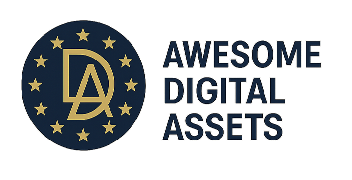

# Awesome Digital Assets in Financial Services (European Focus)    

  
A curated collection of high-quality resources on blockchain, tokenization, and DLT-based capital markets — with a focus on European institutional use cases and regulation.

  
📌 Made for professionals and curious minds who want to understand the evolving DLT-based financial system

⭐️ Resources marked with a star are recommended beginner-friendly entry points.

Want to contribute? See my [Guide for Contributors](contributing.md).

Questions, feedback, or ideas? Reach out on [LinkedIn](https://www.linkedin.com/in/lars-ulbricht/) — Happy to connect!

Disclaimer: The resources linked here do not constitute financial advice and are exclusively external sources. The copyright of these great resources lies with the authors.

## Contents
- [Digital Assets & Tokenization](#digital-assets--tokenization)
  - [DLT-based Capital Market](#dlt-based-capital-market)
  - [Tokenization by Asset Class](#tokenization-by-asset-class)
- [Digital Money](#digital-money)
    - [CBDCs (Central Bank Digital Currencies)](#cbdcs-central-bank-digital-currencies)
    - [Tokenized Bank Deposits](#tokenized-bank-deposits)  
    - [Stablecoins (Privately Issued Money)](#stablecoins-privately-issued-money)
- [Decentralized Finance (DeFi)](#decentralized-finance-defi)
- [Industry Initiatives & Networks](#industry-initiatives--networks)
    - [BIS Innovation Hub](#bis-innovation-hub)
    - [ECB New Technologies for Wholesale Settlement Contact Group (NTW-CG)](#ecb-new-technologies-for-wholesale-settlement-contact-group-ntw-cg)
    - [Other Consortia & Networks](#other-consortia--networks)
- [Technology & Infrastructure](#technology--infrastructure)
    - [Blockchain Platforms (commonly used in industry initiatives)](#blockchain-platforms-commonly-used-in-industry-initiatives)
    - [Custody Solutions](#custody-solutions)
    - [Interoperability Solutions](#interoperability-solutions)
- [Market Insights](#market-insights)
    - [Research & Reports](#research--reports)
    - [Data & Analytics Platforms](#data--analytics-platforms)
- [Regulation](#regulation)
    - [EU Regulatory Frameworks & Relevant Standards](#eu-regulatory-frameworks--relevant-standards)
    - [Regulation Research & Analysis](#regulation-research--analysis)
- [Events (Where to Connect with the Community)](#events-where-to-connect-with-the-community)
- [Thought Leaders, Associations & Standards](#thought-leaders-associations--standards)
- [How to stay up to date (News & Media)](#how-to-stay-up-to-date-news--media)
    - [News Sites](#news-sites)
    - [Podcasts](#podcasts)
    - [Newsletters & Telegram Channels](#newsletters--telegram-channels) 
- [Educational Resources](#educational-resources)
- [Other DLT-related Awesome Lists](#other-dlt-related-awesome-lists)

## Digital Assets & Tokenization
### DLT-based Capital Market
- [MAS: Project Guardian](https://www.mas.gov.sg/schemes-and-initiatives/project-guardian) - Project Guardian references a four layered model to describe technology components in a digital asset network. The reference model provides the context for considering the interactions between different component layers in a digital asset solution. Each layer could be governed and implemented by different actors.
- ⭐️ [GFMA: Impact of Distributed Ledger Technology in Global Capital Markets](https://www.gfma.org/wp-content/uploads/2023/05/impact-of-dlt-on-global-capital-markets-full-report.pdf) - In-depth report covering the topic of a DLT-based capital market from Basics to more advanced topics.
- [Bain: How Tokenization Can Fuel a $400 Billion Opportunity in Distributing Alternative Investments to Individuals](https://www.bain.com/insights/how-tokenization-can-fuel-a-400-billion-opportunity-in-distributing-alternative-investments-to-individuals/) - This paper describes how blockchain and tokenization could directly address the distribution challenges facing the alternatives industry.
- [BCG: Relevance of on-chain asset tokenization in 'crypto winter'](https://web-assets.bcg.com/1e/a2/5b5f2b7e42dfad2cb3113a291222/on-chain-asset-tokenization.pdf) - BCG Report on the relevance of on-chain asset tokenization.
- [Kinexys (JPM): Project EPIC](https://www.jpmorgan.com/kinexys/documents/JPMC-Kinexys-Project-Epic-Whitepaper-2024.pdf) - This report serves as a comprehensive examination of Kinexys' perspective on privacy, identity and composability in asset tokenization.
- [KPMG & KfW: DLT-based Capital Market](https://www.kfw.de/PDF/Investor-Relations/Pdf-Dokumente-Investor-Relations/KPMG-Blockchain-basierter-Kapitalmarkt-Whitepaper_ENG.pdf) - An analysis of the degree of maturity based on KFW's first two blockchain-based digital bonds.
- [Fabian Schär for the European Commission: Enhancing financial services with permissionless blockchains](https://op.europa.eu/en/publication-detail/-/publication/cab54e8e-ad3b-11ef-acb1-01aa75ed71a1/language-en) - This report examines the potential of public permissionless blockchains to enhance traditional financial services. 

### Tokenization by Asset Class

#### Tokenized Funds
- [BCG: Tokenized Funds - The Third Revolution in Asset Management Decoded](https://web-assets.bcg.com/81/71/6ff0849641a58706581b5a77113f/tokenized-funds-the-third-revolution-in-asset-management-decoded.pdf) - Fund tokenization, the third revolution in asset management, offers the potential to create billions of dollars in value for both financial institutions and end investors, according to this whitepaper.
- [Project Guardian: (Tokenized) Funds Framework (GFF)](https://www.mas.gov.sg/-/media/mas-media-library/development/fintech/guardian/guardian-funds-framework.pdf) - The framework provides recommendations for establishing a framework for the tokenisation of the fund lifecycle and activities, including asset servicing, and on-chain share register archetypes and data.
- [DTCC: Smart NAV Pilot Report: Bringing Trusted Data to the Blockchain Ecosystem](https://www.dtcc.com/-/media/Files/Downloads/DTCC-Connection/Smart_NAV-Report.pdf) - As part of this exploration, DTCC developed a new pilot, Smart NAV, which leveraged DTCC's digital asset capabilities, as well as Chainlink, a leading technology platform for cross-chain interoperability, and blockchain abstraction.
- [Analysis of Blackrock's MMF (BUIDL)](https://www.steakhouse.financial/projects/blackrock-buidl#21-record-of-ownership) - Analysis of BlackRock's tokenized Money Market Fund (BUIDL), focusing on ownership structure and solution design.
- [FIRM: DLT and Digital Assets in the Evolving Realm of Asset Management](https://firm.fm/wp-content/uploads/2024/02/FINAL_Round-Table-Assetmanagement_Whitepaper_II.pdf) - This whitepaper examines the integration of DLT into asset management, describing the benefits as well as the potential risks. It also shows a case study by Bankhaus Metzler on the issue and trading of native crypto fund shares under German law.

#### Tokenized Securities & Bonds
- [Project Guardian: Fixed Income Framework (GFIF)](https://www.mas.gov.sg/-/media/mas-media-library/development/fintech/guardian/guardian-fixed-income-framework.pdf) - The framework provides an industry guide to implementing tokenisation in Debt Capital Markets and integrates ICMA Capital Market Association's Bond Data Taxonomy, Capital Markets and Technology Association's Token Standards, and the Global Financial Markets Association's Design Principles for Tokenised Securities.

#### Tokenized Real Estate
- [Deloitte: Digital dividends - How tokenized real estate could revolutionize asset management](https://www2.deloitte.com/us/en/insights/industry/financial-services/financial-services-industry-predictions/2025/tokenized-real-estate.html) - The global market for commercial real estate tokenization is expected to expand dramatically by 2035. Here's how a few players are making waves.

#### Other Tokenized Asset Classes (loans, commodities, etc.)

## Digital Money
<b>Important note</b>: This list covers digital money only when it can potentially be used in capital markets transactions. Therefore, the retail digital euro is currently excluded, as it is intended solely for retail use at this stage.

- [BIS: Leveraging tokenisation for payments and financial transactions](https://www.bis.org/publ/othp92.pdf) - This report was prepared by a technical task force of central bank experts, chaired by Fabio Araujo (Central Bank of Brazil). Its main purpose is to open the discussion about asset tokenisation and its role in integrated financial ecosystems and to report on the experiments being conducted in the region.

### CBDCs (Central Bank Digital Currencies)
#### Wholesale CBDCs
- [Cambridge: Wholesale Central Bank Digital Currencies - Approaches, Implementation Strategies and Use Cases](https://www.jbs.cam.ac.uk/wp-content/uploads/2024/12/2024-12-ccaf-wcbdcs-approaches-implementation-strategies-and-use-cases.pdf) - The report aims to provide valuable insights on key opportunities and risks surrounding wholesale CBDCs, help facilitate public-private dialogue and further our collective understanding of this rapidly evolving space.
- [ECB Wholesale CBDC](https://www.ecb.europa.eu/paym/integration/distributed/exploratory/html/index.en.html#exploratory) - Amid growing interest in potentially using distributed ledger technology (DLT) to settle wholesale financial transactions, in 2024 the Eurosystem tested three interoperability-type solutions.
    - [Trigger Solution by German Bundesbank](https://www.bundesbank.de/en/tasks/payment-systems/trigger-solution/conducted-trials-and-experiments-with-the-trigger-solution-918546) - Overview of all trials conducted with the trigger solution by German Bundesbank.
    - [TIPS Hash-Link by Banca d'Italia](https://www.ecb.europa.eu/press/intro/news/html/ecb.mipnews231213_annex3.en.pdf) - Description of the TIPS Hash-Link solution tested during the ECB trials by Banca d'Italia.
    - [Full DLT interoperability solution by Banque de France](https://www.banque-france.fr/en/financial-stability/financial-stability-mandate/supporting-digital-transformation-financial-sector/wholesale-mnbc) - Overview Page of different materials on Wholesale CBDC initiatives by the Banque de France.

#### Retail CBDCs
- [Atlantic Council CBDC Tracker](https://www.atlanticcouncil.org/cbdctracker/) - Atlantic Council CBDC Tracker – Interactive tracker monitoring CBDC development globally. Provides up-to-date status on 100+ countries' CBDC projects (research, pilot, launched), including European initiatives like the euro, e-krona, digital pound, and various wholesale CBDC experiments.
- [CBDC Tracker](https://cbdctracker.org/) - The CBDC Tracker is a website that provides information on ongoing projects and developments in the field of Central Bank Digital Currencies (CBDCs). The CBDC Tracker serves as a central source of information for those interested in keeping up to date with global developments in the field of central bank digital currencies.

### Tokenized Bank Deposits
- [DK: Commercial Bank Money Token (CBMT)](https://die-dk.de/media/files/20230523_GBIC_Working_Paper_on_Commercial_Bank_Money_Token_V1.51.pdf) - The commercial bank money token, CBMT, represents a pioneering step towards a more digitalised financial system, achieved by placing commercial bank money onto distributed ledger technology, DLT.
  - [Commercial Bank Money Token: Proof of Concept Report](https://die-dk.de/media/files/240716_DKBDI_position_CBMT_final.pdf) - Report by the BDI on potential use cases of the CBMT.
  - [CBMT Webinar by DK](https://vimeo.com/944758182) - In this recording of the 90-minute online webinar on CBMT, the banks and industrial companies involved in the CBMT proof-of-concept present the concept of a bank money token, show the technical implementation of practical industry use cases in blockchain environments and answer questions from participants.
- [Deposit Tokens: A foundation for stable digital money](https://www.oliverwyman.com/content/dam/oliver-wyman/v2/publications/2023/feb/oliver-wyman-jp--morgan-deposit-tokens-report-final.pdf) - Report of Oliver Wyman explaining the role deposit tokens can play in the evolution of digital money.
- [EBA: Report on Tokenised Deposits](https://www.eba.europa.eu/sites/default/files/2024-12/4b294386-1235-463f-b9b5-08f255160435/Report%20on%20Tokenised%20deposits.pdf) - As part of the European Banking Authority's (EBA) 2024-25 priorities on innovative applications, an analysis on the tokenisation of deposits by credit institutions has been carried out to identify existing cases, potential benefits and challenges, and actions the EBA and competent authorities may take to address any identified issues.

### Stablecoins (Privately Issued Money)
- [Circle Payments Network Whitepaper](https://6778953.fs1.hubspotusercontent-na1.net/hubfs/6778953/PDFs/Whitepapers/CPN_Whitepaper.pdf) - Circle Payments Network brings financial institutions together in a compliant, seamless, and programmable framework to orchestrate global payments in fiat, USDC, and other payment stablecoins.
- [Ubyx: Stablecoin Ubiquity](https://www.ubyx.xyz/) - Ubyx proposes the idea of a clearing system that allows to deposit stablecoins from many issuers and multiple currencies into existing bank and fintech accounts and receive full value with the goal to meet the test for singleness of money.

## Decentralized Finance (DeFi)
- [BIS Paper: Cryptocurrencies and decentralised finance](https://www.bis.org/publ/bppdf/bispap156.htm) - A framework for prudential regulation that can mitigate risks while fostering innovation in the rapidly evolving crypto ecosystem.

## Industry Initiatives & Networks
### BIS Innovation Hub

The BIS Innovation Hub aims to foster international collaboration on innovative financial technology within the central banking community.

- [BIS Innovation Hub](https://www.bis.org/about/bisih/about.htm)
  - [Tokenisation in the context of money and other assets: concepts and implications for central banks](https://www.bis.org/cpmi/publ/d225.pdf) - Joint report by the Bank for International Settlements (BIS) and Committee on Payments and Market Infrastructures (CPMI).
  - [Project Agorá](https://www.bis.org/about/bisih/topics/fmis/agora.htm) - The project builds on the unified ledger concept proposed by the BIS and will investigate how tokenised commercial bank deposits can be seamlessly integrated with tokenised wholesale central bank money in a public-private programmable core financial platform.
  - [Project Aurum 2.0](https://www.bis.org/about/bisih/topics/cbdc/aurum2_0.htm) - The project seeks to advance the practical understanding of central banks around privacy when designing their CBDC systems and demonstrate to public sector how technology can protect personal data in the CBDC space.
  - [Project Promissa](https://www.bis.org/about/bisih/topics/fmis/promissa.htm) - The project experiments with the concept of synchronisation, in which transactions settle using central bank money (reserves kept by commercial banks in the central bank) in an RTGS system.
    - [Project Promissa: Final Project Report](https://www.bis.org/publ/othp93.pdf)

  - [Project Polaris](https://www.bis.org/about/bisih/topics/cbdc/polaris.htm) - Project Polaris, from the BIS Innovation Hub Nordic Centre, is focused on designing secure and resilient CBDC systems, online and offline. Over several workstreams, Project Polaris will provide central banks with the essential information needed to inform decision-making, architecture, design, implementation planning and investments.
  - [Project Jura](https://www.bis.org/about/bisih/topics/cbdc/jura.htm) - Project Jura explores the direct transfer of euro and Swiss franc wholesale central bank digital currencies (wCBDCs) between French and Swiss commercial banks on a single DLT platform operated by a third party. It continues the experimentation under Project Helvetia and is part of a series of wholesale CBDC experiments initiated by the BdF in 2020.
  - [Project Helvetia](https://www.bis.org/about/bisih/topics/cbdc/helvetia.htm) - Project Helvetia started a multi-phase investigation by the BIS Innovation Hub, the Swiss National Bank (SNB) and the financial infrastructure operator SIX. The project explored how central banks could offer settlement in central bank money in a future with more tokenised financial assets based on distributed ledger technology (DLT), focusing on operational, legal and policy questions.
  - [Project Icebreaker](https://www.bis.org/publ/othp61.htm) - Project Icebreaker explored a specific way to interlink rCBDC systems (the hub-and-spoke solution) with several additional features that would allow the Icebreaker model to be readily scaled up.
  - [Project Meridian](https://www.bis.org/about/bisih/topics/fmis/meridian.htm) - The project experiments with the concept of synchronisation, in which transactions settle using central bank money (reserves kept by commercial banks in the central bank) in an RTGS system.
      - [Project Meridian: Final Project Report](https://www.bis.org/publ/othp63.pdf)

### ECB New Technologies for Wholesale Settlement Contact Group (NTW-CG)

The New Technologies for Wholesale settlement Contact Group (NTW-CG) provides expert input and keeps the Eurosystem up to date with advances in the use of distributed ledger technology and other new technologies in wholesale financial markets.

- [3rd NTW-CG Meeting: Presentations on Benefits of DLT-based settlement (by HQLA, Onyx / Kynexis, Fnality, HSBC, Goldman Sachs, ING and SWIFT)](https://www.ecb.europa.eu/paym/groups/ntwcg/pdf/ecb.ntwdocs230907_business_cases_3rd_ntwcg_meeting.en.pdf?6de2491857a22869256bd39badce2eaa) - Members of the NTW-CG were invited to report on business cases in the payments, securities, and collateral management domains where DLT could make a difference compared to non-DLT settlement systems.
- [5th NTW-CG Meeting: Presentations on Business Cases and Interoperability Standards (by BNP Paribas, DZ Bank / Deutsche Börse, Intesa Sanpaolo, KFW, Societe Generale, SWIFT / ING and AFME / GFMA)](https://www.ecb.europa.eu/paym/groups/ntwcg/pdf/ecb.ntwdocs231115_business_cases_5th_ntwcg_meeting.en.pdf?9da5238b2e28673085acf5eeb9544589) - Members of the NTW-CG were invited to report on business cases and interoperability standards for DLT-based settlement.
- [6th NTW-CG Meeting: Presentations on Business Cases (by ABI / Spunta Banca DLT, AXA / Union Investment, DZ Bank, Kynexis / Onyx and DekaBank / SWIAT)](https://www.ecb.europa.eu/paym/groups/ntwcg/pdf/ecb.ntwdocs240125_business_cases_6th_ntwcg_meeting.en.pdf?699a31762d1ff99c15d8f9f7c51dcbe3) - Members of the NTW-CG were invited to report on business cases and interoperability standards for DLT-based settlement.
- [8th NTW-CG Meeting: Presentations on New Technologies for Settlement (by DTCC / Clearstream / Euroclear, Crédit Agricole, SWIAT and SWIFT)](https://www.ecb.europa.eu/paym/groups/ntwcg/pdf/ecb.ntwdocs240618_member_presentations_8th_ntwcg_meeting.en.pdf?aff577b160700d389c28ab188ab55473) - Members' presentations on topics related to new technologies for settlement of wholesale financial transactions in central bank money.
- [9th NTW-CG Meeting: Presentation on Republic of Slovenia issuance of digital bond during the exploratory work](https://www.ecb.europa.eu/paym/groups/ntwcg/pdf/ecb.ntwdocs240925_invitees_presentations_9th_ntwcg_meeting.en.pdf?1a1e8d3639f11c3c3e92b32a5ea0b160) - On 25 July 2024, the Republic of Slovenia issued its inaugural digital bond. The transaction is the first such transaction of an EU sovereign, and one of the first sovereigns worldwide. Republic of Slovenia representatives will present the motivations and implications for a sovereign issuer to explore new technologies, as well as share some findings from the experience made.
- [10th NTW-CG Meeting: Presentations by members on keeping momentum, a cooperative ecosystem and avoiding fragmentation (by BIS, AFME, BNP Paribas, Crédit Agricole, Deutsche Börse, HSBC, Kinexys, KFW and Regulated Layer One (RL1) / SWIAT )](https://www.ecb.europa.eu/paym/groups/ntwcg/pdf/ecb.ntwdocs241126_member_presentations_10th_ntwcg_meeting.en.pdf?eb5490d3879ea928a3ffc00922b3c61f) - Multiple CG members volunteered to present their view on (some of) the following topics: Keeping the momentum after the exploratory work, towards a cooperative ecosystem, how to avoid fragmentation and the creation of asset silos.

### Other Consortia & Networks
- [Regulated Liability Network (RLN)](https://regulatedliabilitynetwork.org/) - The Regulated Liability Network (RLN) is a contribution to the global debate on the future of money offered by a group of industry participants. It explores the technical, legal and business characteristics necessary to provide on-chain, 24*7 programmable, final settlement in sovereign currencies, consisting of the liabilities of both public and private regulated financial institutions.
- [Canton Network](https://www.canton.network/) - A privacy-enabled interoperable blockchain network for institutional assets, launched in 2023 by Digital Asset and a consortium of financial firms. Aims to connect disparate systems and permissioned ledgers (using DAML smart contracts) into a synchronized network, allowing atomic transactions across organizations while preserving privacy – e.g. for interbank trading, collateral, and asset tokenization use cases.
- [Regulated Layer One (RL1) / SWIAT](https://www.linkedin.com/company/regulated-layer-one-rl1/) - RL1 is a global, open, and interoperable network designed for the financial services industry.

## Technology & Infrastructure
### Blockchain Platforms (commonly used in industry initiatives)
- [Hyperledger Fabric](https://hyperledger-fabric.readthedocs.io/) - Hyperledger Fabric, an open-source project from the Linux® Foundation, is a modular blockchain framework that is used for many non-financial blockchain use cases, but was also used in some popular initiatives like the Bundesbank Trigger Solution.
- [Hyperledger Besu](https://besu.hyperledger.org/) - Hyperledger Besu is one of the most common frameworks for institutions that want to build on an EVM-based technology for the broad developer ecosystem and the flexibility to potentially switch to public later.
- [Corda](https://r3.com/corda/) - The Corda platform was created by the enterprise blockchain and software development company R3. Corda is an open-source blockchain-based distributed ledger technology and smart contract platform. It is especially popular among banks as it is based on known principles and programming languages (JVM / Kotlin).
- [DAML](https://www.digitalasset.com/developers) - DAML is an open-source smart contract language for building future-proof distributed applications developed by the company Digital Asset. It has been used in multiple company initiatives, e.g. the Canton Network.

### Custody Solutions
- [Fireblocks](http://fireblocks.com/) - A leading digital asset infrastructure platform offering secure custody, wallet-as-a-service, payments, and tokenization solutions. Fireblocks employs multi-party computation (MPC) technology to safeguard digital assets (e.g., used by Revolut, Crypto.com). 
- [Taurus](http://taurushq.com/) - A Swiss-based digital asset infrastructure provider offering a comprehensive platform for custody, issuance, and management of digital assets (e.g., used by Deutsche Bank, State Street, Santander, UBS).
- [Metaco](http://metaco.com/) - A Swiss digital asset custody firm acquired by Ripple, providing custody orchestration platforms for financial institutions (e.g., used by Citi, BBVA, DBS, BNP Paribas, DZ Bank, Standard Chartered)
- [BitGo](http://bitgo.com/) - Pioneering multi-signature wallet technology, BitGo provides institutional-grade custody with advanced security protocols, insurance coverage, and real-time portfolio tracking capabilities (e.g. used by Galaxy Digital (acquired BitGo), Pantera Capital, Nexo).
- [Ledger Enterprise](https://enterprise.ledger.com/) - Enterprise-grade custody with HSM-backed private key storage and governance workflows (e.g., used by Nomura (via Komainu), Uphold).
- [Copper](https://copper.co/) - Custody and off-exchange settlement (ClearLoop), focused on institutional flexibility and DeFi access (e.g., used by Bitfinex).

### Interoperability Solutions
- [Project Guardian: Interlinking Networks](https://www.mas.gov.sg/-/media/mas-media-library/development/fintech/guardian/interlinking-networks-technical-paper-vfinal.pdf) - This report proposes a common model for linking digital asset networks implemented on diverse ledger technologies and describes common archetypes for the issuance, distribution and transfer of digital assets and introduces a reference model for cross-network exchanges.
- [Project Guardian: Enabling Open & Interoperable Networks](https://www.mas.gov.sg/-/media/mas-media-library/development/fintech/project-guardian/project-guardian-open-interoperable-network.pdf) - This report proposes a framework for designing open interoperable digital asset networks.
- [Axelar: Institutional Interoperability - How Financial Institutions Navigate a Multichain World](https://cdn.prod.website-files.com/65f28017eaba8cd1f912fa9f/66620cac0c974554aba4846e_Institutional%20Interoperability%20White%20Paper.pdf) - The report addresses how financial institutions can achieve increased accessibility and liquidity for tokenized assets, with flexibility, privacy, transparency and scalability. All the contributors to the paper emphasized the need for interlinked network models that embrace multiple blockchains.

## Market Insights
### Research & Reports
- [EBA and ESMA analyse recent developments in crypto-assets](https://www.esma.europa.eu/press-news/esma-news/eba-and-esma-analyse-recent-developments-crypto-assets) - The European Banking Authority (EBA) and the European Securities and Markets Authority (ESMA) published a Joint Report on recent developments in crypto-assets, analysing decentralised finance (DeFi) and crypto lending, borrowing and staking.
- [BCG: Approaching the Tokenization Tipping Point](https://media-publications.bcg.com/Tokenized-Assets.pdf) - This report, by Ripple and Boston Consulting Group, lays out the state of tokenization today, where it's heading in the next five to eight years, and why now is the moment to act—before the pace is set entirely by early movers, many of whom are already shaping the market. 
- [Deutsche Bank and Baker McKenzie: Tokenization of Financial Markets: Mapping the Plausible Future through Scenario Analysis](https://www.bakermckenzie.com/-/media/files/insight/publications/2025/04/baker-mckenzie-x-deutsche-bank-whitepaper.pdf) - The report, developed by Baker McKenzie and Deutsche Bank Singapore, explores the potential of tokenization to transform financial markets. Using scenario analysis, it identifies the key drivers and suggests timed interventions.
- [2025 – the year of payment stablecoins](https://www2.deloitte.com/content/dam/Deloitte/us/Documents/Advisory/us-advisory-deloitte-2025-the-year-of-payment-stablecoins.pdf) - The report published by Deloitte in March 2025, payment stablecoins (PSCs) are currently being pursued with increasing interest by traditional financial institutions and integrated into digital financial infrastructure.
- [Hong Kong Monetary Authority: Distributed Ledger Technology in the Financial Sector: A Study on the Opportunities and Challenges](https://www.hkma.gov.hk/media/eng/doc/key-functions/banking-stability/DLT_Research_Paper.pdf) - This paper aims to provide a comprehensive overview of the role of DLT in the financial sector, including its potential use cases, benefits, and challenges. 
- [Citi: Digital Dollars - Banks and Public Sector Drive Blockchain Adoption](https://www.citigroup.com/rcs/citigpa/storage/public/GPS_Report_Blockchain_Digital_Dollar.pdf) - This report focuses on two key areas: enabling new financial instruments – such as stablecoins – and modernizing legacy systems.
- [CFA: An Investment Perspective on Tokenization](https://rpc.cfainstitute.org/research/reports/2025/investment-perspective-tokenization) - An extensive report on tokenization by the CFA Institute reveals what astute players already sense: we're not just evolving systems – we're redesigning the DNA of finance.
  - [Part 1](https://rpc.cfainstitute.org/sites/default/files/docs/research-reports/tokenization_part-i_online-1.pdf) - Part I of the research series is a primer on tokenization in which we look at the technical process — what tokenization is, how it works, its value proposition, and current limitations.
  - Part 2 (Still to be released) - Part II of the research, in a forthcoming report, will present an analysis of the policy implications related to the digitalization of finance in general and tokenization in particular.
- [Association for Financial Markets in Europe (AFME)](https://www.afme.eu/) - The Association for Financial Markets in Europe (AFME) is an industry advocacy organization that represents wholesale market participants in Europe, including the European Union and the United Kingdom.
  - [AFME: DLT-Based Capital Market Report - Size and Growth of the Global DLT Wholesale Market](https://www.afme.eu/Portals/0/DispatchFeaturedImages/AFME%20DLT-Based%20Capital%20Market%20Report%202024.pdf) - This report provides a comprehensive overview of the primary DLT-based fixed income market, secondary market activity and valuations, repo transactions, and the growth of the tokenized fund industry alongside other tokenized assets.
  - [AFME: Scaling DLT-based Capital Markets - A Policy Roadmap for the EU](https://www.afme.eu/Portals/0/DispatchFeaturedImages/AFME_DLT_SSA_Bonds_Policymaker_EU_05.pdf) - This Policy Roadmap sets out an 8-point plan focusing on specific policy and regulatory changes that are necessary to enable that development and growth of DLT-based capital markets.
  - [AFME: Scaling DLT-Based SSA and Government Bond Markets - A Roadmap Strategy for European Issuers](https://www.afme.eu/Portals/0/DispatchFeaturedImages/AFME_DLT_SSA_Bonds_Issuers_08%20(1)-1.pdf) - While DLT is being adopted in different parts of capital markets, this roadmap focuses on adoption of DLT in markets for bonds issued by European sovereigns, supranational institutions and public-sector agencies.
  

##### 🇩🇪 German Resources
- [Deka Digital Assets Monitor Q4 2024](https://www.deka.de/site/dekade_deka-gruppe_site/get/params_E-283343169/22365381/Deka%20Digital%20Asset%20Monitor_2024.pdf) - The Deka Digital Assets Monitor observes the development of tokenized securities and assesses progress and challenges.

### Data & Analytics Platforms
- [Particula Reports](https://particula.io/category/ratings/) - High quality reports and ratings for individual projects.
- [rwa.xyz](https://app.rwa.xyz/) - Rwa.xyz aggregates and standardizes first-party data to provide an accurate and intuitive market intelligence experience for investors, protocols, regulators, and service providers. We are a New York City-based company.
- [Cambridge Digital Money Dashboard](https://ccaf.io/cdmd/) - The CDMD is envisaged to be a one-stop platform that brings together relevant digital asset adoption and risk indicators, allowing for multi-stakeholder uses and comparison. It aims to offer policymakers, financial authorities, academics, industry and the general public access to reliable information and analytical tools for thorough and insightful decision making.

## Regulation

### EU Regulatory Frameworks & Relevant Standards
- [MiCAR](https://eur-lex.europa.eu/EN/legal-content/summary/european-crypto-assets-regulation-mica.html) - Markets in Crypto-Assets (MiCA) Regulation – Landmark EU regulation (2023) establishing a harmonized framework for crypto-asset issuers, service providers, and stablecoins.
- [BCBS: SCO60 - Cryptoasset exposures](https://www.bis.org/basel_framework/chapter/SCO/60.htm?inforce=20250101&published=20221216) - Basel Committee Cryptoasset Exposure Standard – Global banking standard (Dec 2022) for prudential treatment of banks' crypto-asset exposures.
- [Travel Rule](https://eur-lex.europa.eu/EN/legal-content/summary/information-accompanying-transfers-of-funds-and-certain-crypto-assets.html) - EU Transfer of Funds (Travel Rule) Regulation – Implements the FATF “Travel Rule” in the EU (Regulation 2023/1113), requiring CASPs to include sender/receiver info with crypto transfers (effective Dec 2024).
- [EU DLT Pilot Regime](https://eur-lex.europa.eu/EN/legal-content/summary/market-infrastructures-based-on-distributed-ledger-technology.html?fromSummary=14) - EU DLT Pilot Regime – EU's pilot framework (2023–2026) allowing market infrastructures to trade and settle tokenized securities on DLT with temporary regulatory exemptions.
- [DORA](https://eur-lex.europa.eu/EN/legal-content/summary/digital-operational-resilience-for-the-financial-sector.html) - The Digital Operational Resilience Act (DORA) is an EU regulation aimed at strengthening the digital resilience of financial entities. It establishes a framework for managing Information and Communication Technology (ICT) risks, ensuring financial institutions can withstand, respond to, and recover from ICT disruptions.

### Regulation Research & Analysis
- [PwC Global Crypto Regulation Report 2025](https://legal.pwc.de/content/services/global-crypto-regulation-report/pwc-global-crypto-regulation-report-2025.pdf) - This report provides an overview of the global regulatory landscape, how the regulatory frameworks are developing across the world, and the impact on crypto and traditional financial services firms.

## Events (Where to Connect with the Community)
- [Crypto Assets Conference (CAC)](https://crypto-assets-conference.de/) - The Crypto Assets Conference offers in-depth insights into current topics shaping the financial world. Over 500 industry experts, leading financial players, and regulatory decision-makers will meet in Frankfurt to discuss the latest developments in blockchain, digital assets and tokenized securities, including international regulatory frameworks.
- [Paris Blockchain Week](https://www.parisblockchainweek.com/) - Paris Blockchain Week is the premier destination for blockchain professionals, attracting the world's foremost thought leaders, innovators, and industry drivers. As a pioneering event in the blockchain space, it is dedicated to fostering unparalleled innovation, collaboration, and knowledge sharing.
- [Digital Euro Conference](https://digital-euro-conference.de/en/) - One of the largest events exclusively for advancements in central bank digital currencies, stablecoins, commercial bank money tokens, and the future of money.
- [Digital Assets Week](https://daweek.org/) - Conference series focused on institutional adoption of digital assets. Brings together banks, asset managers, fintechs, and regulators to discuss tokenized securities, regulatory compliance (MiCA, etc.), and innovations in crypto-market infrastructure.
- [European Blockchain Convention](https://eblockchainconvention.com/) - European Blockchain Convention – One of Europe's premier blockchain events (held in Barcelona). Gathers industry leaders, startups, and EU policymakers to explore blockchain in finance. Features panels on topics like MiCA compliance, enterprise DLT use cases, and the future of Web3 in the European financial sector.
- [TUM Blockchain Conference](https://conference.tum-blockchain.com/) - The TUM Blockchain Conference unites visionaries and thought leaders in a non-profit setting to transform Web3's potential from promise to action through collaboration and open dialogue. This initiative, organized by the TUM Blockchain Club, is fueled by students' passion for education, innovation, and community.

## Thought Leaders, Associations & Standards
- [INATBA](https://inatba.org/) - INATBA (International Association for Trusted Blockchain Applications) – Industry association convening blockchain developers, corporates, and policymakers (launched with EU Commission support). INATBA works on public-private dialogue and produces working group outputs on topics like privacy, interoperability, and regulatory compliance (e.g. recommendations on DeFi regulation and social impact of DLT).
- [Global Digital Finance (GDF)](https://www.gdf.io/) - Global Digital Finance (GDF) – Global members organization advocating for best practices and standards in the digital assets industry. Publishes an influential Code of Conduct for cryptoasset and DeFi firms, taxonomy reports, and engages with regulators (including Europe's regulators) on policy development.
- [Digital Euro Association (DEA)](https://home.digital-euro-association.de/en) - Digital Euro Association (DEA) – Think tank focusing on CBDCs, stablecoins, and other forms of digital money in Europe. Provides research papers, webinars, and policy recommendations – for example, analyses of digital euro design choices, privacy issues, and how a euro CBDC could coexist with private-sector stablecoins.

## How to stay up to date (News & Media)

### News Sites

- ⭐️ [Ledger Insights](https://www.ledgerinsights.com/) - One of the most comprehensive news sites for institutional blockchain news.
- [CoinDesk](https://www.coindesk.com/) - One of the largest and most popular crypto media outlets in the world. Originally founded in 2013, CoinDesk features news articles, videos, podcasts, and newsletters for breaking news and expert opinions.
- [Forbes: Digital Assets](https://www.forbes.com/digital-assets) - Insights into the biggest events shaping the blockchain and crypto industry.
- [The Block](https://www.theblock.co/) - The Block features breaking crypto news, in-depth research reports, and data dashboards that illustrate on-chain metrics.

### Podcasts
- ⭐️ [Bitcoin, Fiat & Rock'n'roll](https://bfrr.info/) - The finance podcast between the traditional and the future financial system built on blockchain.
- [Chainalysis: Public Key Podcast](https://www.chainalysis.com/blog/category/podcast/) - Public Key is the cryptocurrency and compliance podcast, brought to you by Chainalysis. Every week Chainalysis Chief Marketing Officer, Ian Andrews sits down with thought leaders in the space to discuss a range of topics.
- [On The Brink with Castle Island](https://castleisland.libsyn.com/) - A popular weekly podcast (by Castle Island Ventures) covering crypto and digital asset industry news from an institutional and policy angle. Frequent discussions on regulation, market structure, and macro trends with notable guests (industry executives, researchers, and regulators).
- [Bankless](https://www.bankless.com/podcast) - An influential podcast exploring how blockchain and Web3 can transform finance and society.
- [The Money Movement](https://www.circle.com/the-money-movement) - A podcast hosted by Circle CEO Jeremy Allaire, focusing on digital currency in finance. Episodes (2020–present) cover trends like stablecoin use in banking, CBDC developments, and conversations with bankers, technologists, and lawmakers shaping the future of money.

##### 🇩🇪 German Resources

- [Crypto Nerds Podcast](https://crypto-nerds-podcast.podigee.io/) - Practical crypto knowledge for beginners and anyone who wants to learn more. Are you new to the topics of crypto, Bitcoin, Web3 & Co? Then the Crypto Nerds Podcast is the right place for you. 

### Newsletters & Telegram Channels
- [CoinDesk Newsletter](https://www.coindesk.com/newsletters) - Free newsletter (published weekly) that tracks the intersection of cryptocurrency and government. Excellent for staying updated on regulatory developments, enforcement actions, and policy debates in the US, Europe, and globally – including coverage of EU initiatives like MiCA, AML rules, and central bank digital currencies.
- [RWA Tokenization Insights by Particula](https://t.me/tokenizedrwa) - Up to date Insights on Real-World Asset Tokenization and Institutional Adoption Across All Asset Classes.

##### 🇩🇪 German Resources
- ⭐️ [Blockstories Newsletter](https://www.blockstories.de/) - Every Tuesday & Friday, we send out a newsletter that informs thousands of readers about the most important developments on the crypto market. Compact, to the point and without hype.

## Educational Resources

- [TUM Blockchain-based Systems Engineering - Lecture Slides](https://github.com/sebischair/bbse) - This GitHub-repository contains all contents of the lecture Blockchain-based Systems Engineering (IN2359), held regularly in the summer term at the Technical University of Munich.
- ⭐️ [MIT OpenCourseWare - Blockchain And Money](https://ocw.mit.edu/courses/15-s12-blockchain-and-money-fall-2018/download/) - Course for students wishing to explore blockchain technology's potential use—by entrepreneurs & incumbents—to change the world of money and finance by Prof. Gary Gensler.
- [Web3 Mentoring Journeys by the Frankfurt School](https://web3-talents.io/) - Kick-start your career in the fields of DLT, DeFi, NFT, and Bitcoin. Web3 Talents offers free 18-week mentoring programs to get you started in web3.

## Other DLT-related Awesome Lists

- [Bitcoin](https://github.com/igorbarinov/awesome-bitcoin#readme) - Bitcoin services and tools for software developers.
- [Ripple](https://github.com/vhpoet/awesome-ripple#readme) - Open-source distributed settlement network.
- [Ethereum](https://github.com/ttumiel/Awesome-Ethereum#readme) - Distributed computing platform for smart contract development.
- [Corda](https://github.com/chainstack/awesome-corda#readme) - Open-source blockchain platform designed for business.
- [Waves](https://github.com/msmolyakov/awesome-waves#readme) - Open-source blockchain platform and development toolset for Web 3.0 apps and decentralized solutions.
- [Substrate](https://github.com/substrate-developer-hub/awesome-substrate#readme) - Framework for writing scalable, upgradeable blockchains in Rust.
- [Stacks](https://github.com/friedger/awesome-stacks-chain#readme) - A smart contract platform secured by Bitcoin.
- [Algorand](https://github.com/aorumbayev/awesome-algorand#readme) - An open-source, proof of stake blockchain and smart contract computing platform.
- [Cosmos SDK](https://github.com/cosmos/awesome-cosmos#readme) - Modular framework for building app-specific blockchains in Go.

 

[↑ Back to top](#contents)
